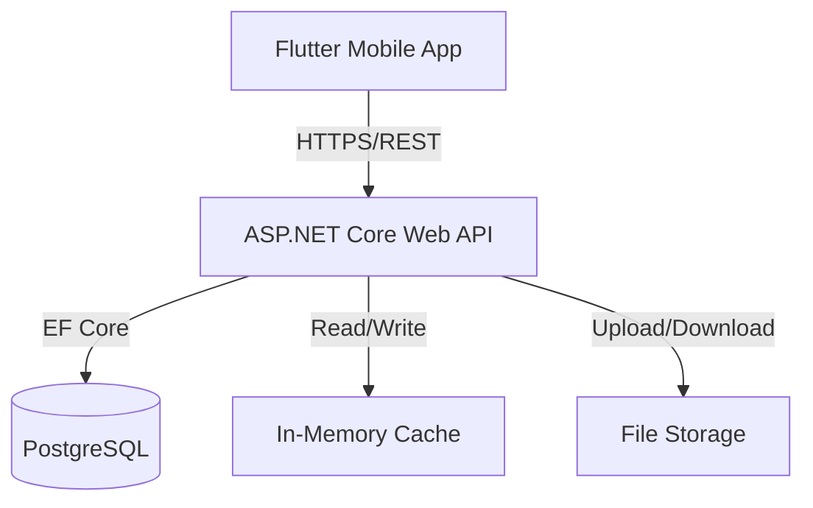

# Technical Architecture

## Quran & Islamic Education Management App (MVP)

---

## 1. High-Level Architecture

The system follows a **clean client–server architecture** with a single backend API serving a mobile-first client.

- **Client**: Flutter Mobile Application (Android & iOS)
    
- **Server**: ASP.NET Core Web API
    
- **Database**: PostgreSQL
    
- **ORM**: Entity Framework Core
    
- **Caching**: In-Memory Caching
    
- **File Storage**: Server file system or external object storage (for submissions)
    

### Architecture Diagram (Conceptual)

---

## 2. Technology Stack

### Frontend (Mobile Client)

- **Framework**: Flutter (Dart)
    
- **Supported Platforms**: Android, iOS
    
- **State Management**: Provider or Riverpod
    
- **Networking**: Dio or http
    
- **Authentication Storage**: Secure Storage / SharedPreferences
    
- **Responsibility**:
    
    - UI rendering
        
    - Form validation
        
    - API communication
        
    - No business logic
        

---

### Backend (API Server)

- **Framework**: ASP.NET Core (REST API)
    
- **Language**: C#
    
- **Architecture Style**:
    
    - Controllers
        
    - Application / Service Layer
        
    - Domain Models
        
    - Infrastructure Layer
        
- **Authentication**:
    
    - JWT (Bearer Tokens)
        
    - Role-based authorization (Admin, Teacher, Student, Parent)
        
- **API Documentation**:
    
    - Swagger / OpenAPI
        
- **Validation**:
    
    - Model validation via Data Annotations / FluentValidation
        

---

### Database Layer

- **Database Engine**: PostgreSQL
    
- **Access Method**: Entity Framework Core
    
- **Schema Source**: DBML-defined schema
    
- **Key Characteristics**:
    
    - UUID primary keys
        
    - Strong relational integrity
        
    - Explicit join tables for many-to-many relations
        
    - Enforced uniqueness constraints
        

---

### ORM (Entity Framework Core)

- **Responsibilities**:
    
    - Database migrations
        
    - Object–Relational Mapping
        
    - Query translation
        
- **Patterns Used**:
    
    - DbContext per bounded context
        
    - Explicit navigation properties
        
    - Lazy loading disabled (explicit includes)
        

---

### Caching Layer

- **Type**: In-Memory Caching (`IMemoryCache`)
    
- **Purpose**:
    
    - Reduce database load
        
    - Improve read performance
        
- **Cached Data Examples**:
    
    - Classes
        
    - Subjects
        
    - Teacher allocations
        
    - User profile metadata
        
- **Cache Strategy**:
    
    - Time-based expiration
        
    - Cache invalidation on write operations
        
- **Scope**:
    
    - Per application instance (non-distributed)
        

---

### File Storage

- **Stored Content**:
    
    - Assignment submissions (Images, PDFs)
        
- **Storage Options**:
    
    - Local server file system (MVP)
        
    - Pluggable for future cloud storage
        
- **Database Responsibility**:
    
    - Store file metadata and URLs only
        
    - Never store binary files in the database
        

---

## 3. Security Architecture

- **Authentication**:
    
    - JWT issued at login
        
    - Token required for all protected endpoints
        
- **Authorization**:
    
    - Role-based access control
        
    - Allocation-based data filtering for Teachers
        
    - Ownership-based filtering for Students
        
    - Relationship-based filtering for Parents
        
- **Transport Security**:
    
    - HTTPS enforced
        
- **Password Storage**:
    
    - Hashed + salted passwords
        

---

## 4. Data Flow Examples

### Authentication Flow

1. User submits credentials via Flutter app
    
2. API validates credentials using EF Core
    
3. JWT token is generated
    
4. Token returned to client
    
5. Client attaches token to all future requests
    

---

### Assignment Submission Flow

1. Student selects assignment
    
2. Student uploads file (`multipart/form-data`)
    
3. API stores file in storage
    
4. API saves submission metadata in PostgreSQL
    
5. Cached assignment data is invalidated if needed
    

---

### Attendance Recording Flow

1. Teacher submits attendance for an allocation + date
    
2. API validates allocation ownership
    
3. Attendance session is created (or rejected if duplicate)
    
4. Attendance records are persisted
    
5. Parent and student views read the data (cached where applicable)
    

---

## 5. Scalability & Constraints (MVP)

- Single API instance
    
- In-memory cache (non-distributed)
    
- Mobile-only client
    
- No real-time communication
    
- Stateless API design
    

---

## 6. Alignment With Other Documents

This architecture is **fully consistent** with:

- Business Requirements Document (BRD)
    
- User Stories
    
- Database Schema (DBML)
    
- API Specification
    

No feature is introduced here that does not exist in the functional or data specifications.